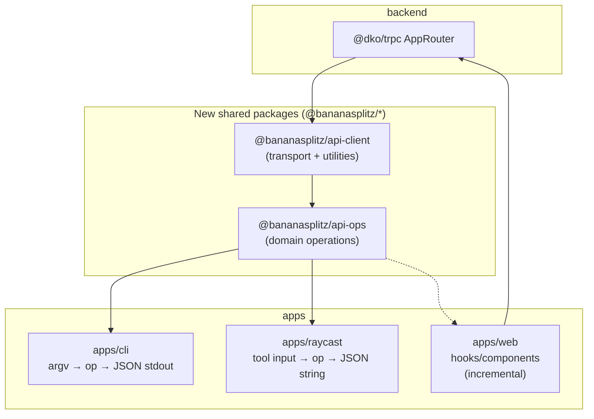
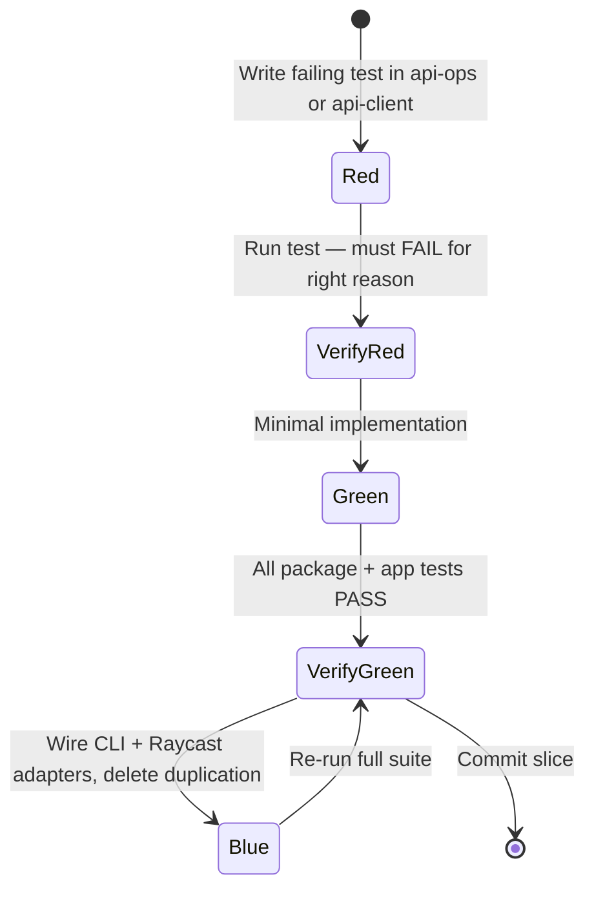

# Shared API Layer — Design

**Status:** Proposed  
**Date:** 2026-05-22  
**Scope:** `apps/cli`, `apps/raycast`, `apps/web` (incremental)  
**Out of scope:** `apps/mcp`, `packages/agent`, full `@dko/*` / `@repo/*` rename

---

## Problem

Three client surfaces talk to the same Lambda tRPC API with duplicated logic:

| Concern | CLI | Raycast | Web |
|---------|-----|---------|-----|
| HTTP tRPC client | `apps/cli/src/client.ts` | `apps/raycast/src/lib/trpc.ts` (copy) | `apps/web/src/utils/trpc.ts` (React Query + initData) |
| Chat scope resolution | `apps/cli/src/scope.ts` | `apps/raycast/src/lib/tools/scope.ts` (copy) | N/A (Telegram session) |
| Domain orchestration | 35 commands in `commands/*.ts` | 35 tools in `tools/*.ts` (parity-checked) | ~45 components call `trpc.*` directly |
| JSON serialization | `output.ts` replacer | `serialize.ts` replacer (copy) | superjson via client |
| Shared helpers | `expense.ts` internals | `expense-update.ts`, `parse.ts` (copies) | inline in components |

The heaviest duplication is **35 identical tRPC orchestration bodies** between CLI and Raycast. Any bugfix or new flag must land twice today.

---

## Goal

Extract a **shared, end-to-end type-safe client layer** so:

1. Each API operation is implemented **once** and consumed by CLI, Raycast, and (optionally) web.
2. New clients (future mobile app, admin tools) plug in without copying command bodies.
3. Behavior is preserved — this is a refactor, not a feature change.
4. Tests live at the shared layer; app adapters stay thin.

---

## Non-goals

- Renaming `@dko/trpc` → `@bananasplitz/trpc` or `@repo/*` → `@bananasplitz/*` in this effort (separate epic; high blast radius).
- Fixing the published npm typo `@banananasplitz/cli` → `@bananasplitz/cli` (requires coordinated npm major).
- Replacing web's `createTRPCReact` hooks wholesale on day one.
- Changing tRPC procedure signatures or backend behavior.

---

## Architecture



### Layer 1: `@bananasplitz/api-client`

**Responsibility:** Transport and cross-cutting client utilities. No domain rules.

Exports:

| Export | Source today | Notes |
|--------|--------------|-------|
| `TrpcClient` | `apps/cli/src/client.ts` | `TRPCClient<AppRouter>` alias |
| `createApiKeyClient({ apiKey, apiUrl })` | CLI + Raycast client factories | `httpBatchLink` + superjson + `x-api-key` |
| `DEFAULT_TRPC_URL` | CLI config default | `https://api.bananasplitz.app/api/trpc` or existing constant |
| `resolveChatId(trpc, chatId?)` | CLI + Raycast `scope.ts` | Unified signature: `string \| number \| undefined` |
| `serializeForJson(value)` | CLI replacer + Raycast `serialize.ts` | BigInt → string, pretty-print optional |
| `ApiValidationError` | new | Typed validation errors ops can throw |

Does **not** include: argv parsing, Raycast preferences, Telegram initData, React Query.

### Layer 2: `@bananasplitz/api-ops`

**Responsibility:** Pure async functions — `(trpc, input) => result`. One function per CLI command / Raycast tool (35 total).

Structure:

```
packages/api-ops/src/
├── index.ts              # re-exports all ops + helpers
├── errors.ts             # ApiValidationError, missing-field helpers
├── parse.ts              # requireField, parsePositiveNumber, etc.
├── helpers/
│   ├── expense-update.ts # applyExpensePartialUpdate
│   ├── recurrence.ts     # buildRecurrenceParams (if shared)
│   └── categories.ts     # enrichExpensesWithCategoryLabels (if shared)
└── ops/
    ├── chat.ts           # listChats, getChat, getDebts, ...
    ├── me.ts
    ├── expense.ts
    ├── settlement.ts
    ├── snapshot.ts
    ├── recurring.ts
    ├── reminder.ts
    └── currency.ts
```

**Naming convention:** ops use camelCase (`getChat`), CLI/Raycast keep kebab-case command names (`get-chat`) as thin wrappers.

**Input types:** Zod schemas co-located with ops where validation is non-trivial. Simple ops use plain TypeScript interfaces mirroring tRPC inputs after client-side normalization (comma-split strings → arrays, etc.).

**Dependencies:** `@bananasplitz/api-client`, `@dko/trpc` (types only via AppRouter inference), `@repo/categories` where needed.

### Layer 3: App adapters (unchanged surface)

| App | Keeps | Delegates to ops |
|-----|-------|------------------|
| **CLI** | `cli.ts`, `config.ts`, `output.ts`, command metadata (options, agentGuidance, examples) | `execute` body → `ops.getChat(trpc, parsedInput)` |
| **Raycast** | `run-tool.ts`, UI commands (`groups.tsx`, `people.tsx`), tool `confirmation` exports | tool handler → `ops.getChat(trpc, input)` |
| **Web** | `createTRPCReact`, routing, forms, optimistic updates | Mutations first: call op inside `mutationFn` or custom hook |

Web auth stays separate: initData header via existing `trpcClient`. Ops accept any `TrpcClient` — web passes the vanilla client from `@trpc/client` or a thin wrapper, not the api-key factory.

---

## Package naming

### Decision (user-confirmed)

New shared packages use **`@bananasplitz/*`**.

| Package | Name |
|---------|------|
| Transport layer | `@bananasplitz/api-client` |
| Domain ops | `@bananasplitz/api-ops` |

### Existing names — unchanged in this refactor

| Current | Action |
|---------|--------|
| `@dko/trpc`, `@dko/database` | Keep; rename is follow-up epic |
| `@repo/categories`, `@repo/ui`, etc. | Keep |
| `@banananasplitz/cli` (npm typo) | Keep published name; fix separately |
| Root `dko-turbo` | Keep |
| Raycast app `bananasplitz` | Keep filter name; add workspace dep on new packages |

### Future rename epic (document only)

When ready, migrate in order: `@repo/typescript-config` → `@bananasplitz/typescript-config`, then `@dko/trpc` → `@bananasplitz/trpc`, etc. Use pnpm overrides + re-export shims for one release cycle.

---

## Red-Green-Blue TDD strategy

We use **RGB** (Red → Green → Blue) per vertical slice. Same as Red-Green-Refactor; **Blue** is the explicit refactor/cleanup phase while tests stay green.



### Where tests live

| Layer | Test location | Style |
|-------|---------------|-------|
| `api-client` | `packages/api-client/src/*.test.ts` | Pure unit tests (serialize, resolveChatId with mock trpc) |
| `api-ops` | `packages/api-ops/src/ops/*.test.ts` | Mock `TrpcClient` sub-trees; assert procedure args + validation errors |
| CLI | Existing `commands/*.test.ts` | **Migrate gradually**: tests eventually assert adapter calls op (or keep testing execute end-to-end) |
| Raycast | Add `src/tools/*.test.ts` selectively | High-value mutating tools only; most coverage via ops tests |
| Web | Existing component tests | Unchanged until web adoption slice |

### Refactor invariant (every slice)

Before merge, all of these must pass:

```bash
pnpm --filter @bananasplitz/api-client test
pnpm --filter @bananasplitz/api-ops test
pnpm --filter @banananasplitz/cli test
pnpm --filter bananasplitz check-parity
pnpm --filter bananasplitz check-types
turbo check-types
```

### Behavior preservation

- No change to CLI stdout/stderr JSON shape.
- No change to Raycast tool return strings (except bugfixes).
- CLI version bump policy: **patch** bump per slice (internal refactor) unless output shape changes.

---

## Vertical slices

Each slice is one mergeable PR. Ops tests are written first (Red), implemented (Green), then CLI + Raycast wired and duplicates removed (Blue).

### SLICE-00 — Walking skeleton (`api-client`)

- **Demoable as:** CLI and Raycast build; `resolveChatId` + `createApiKeyClient` imported from shared package; zero behavior change.
- **AC:** Shared client utilities extracted; duplicated `client.ts` / `scope.ts` / `serialize.ts` deleted from apps.

### SLICE-01 — Pilot op: `get-chat`

- **Demoable as:** `banana get-chat --chat-id X` and Raycast `get-chat` tool behave identically to pre-refactor.
- **AC:** First op in `api-ops`; pattern documented for remaining 34 ops.

### SLICE-02 — Chat domain (remaining 4 ops)

- `list-chats`, `get-debts`, `get-simplified-debts`, `update-chat-settings`

### SLICE-03 — Me domain (4 ops)

- `list-my-balances`, `list-my-spending`, `list-counterparty-balances`, `settle-all-with`

### SLICE-04 — Expense domain (~12 ops)

- Includes `applyExpensePartialUpdate` helper extraction; largest slice — may split into 04a (read) + 04b (write) if PR too large.

### SLICE-05 — Settlement (4 ops)

### SLICE-06 — Snapshot (5 ops)

### SLICE-07 — Recurring (4 ops)

### SLICE-08 — Reminder + currency + category (4 ops)

### SLICE-09 — Hardening

- Parity script extension: verify each CLI command's execute body references `@bananasplitz/api-ops`
- `packages/api-ops/AGENTS.md` contributor guide
- Root `AGENTS.md` cross-link

### SLICE-10 — Web pilot (optional, separate PR series)

- One mutation hook wrapping an op (e.g. `updateChatSettings`)
- Document pattern for incremental web migration; no big-bang component rewrite

---

## CI and release impact

- New packages participate in `turbo test` and `turbo check-types` automatically via workspace.
- CLI publish job triggers on `packages/**` changes — patch bumps each slice.
- Raycast: no npm publish; `check-parity` remains the contract test.
- No new env vars or infrastructure.

---

## Risks and mitigations

| Risk | Mitigation |
|------|------------|
| Slice too large (expense) | Split 04a/04b; merge read paths first |
| CLI/Raycast input shape drift | Ops accept normalized internal types; adapters own flag/name mapping |
| Web React Query cache invalidation | Web slice deferred; ops don't touch query keys |
| `@banananasplitz/cli` vs `@bananasplitz/*` confusion | Document in package README; align on correct spelling for new packages only |
| Regression in 35 commands | Ops tests + existing CLI tests + parity check every slice |

---

## Open questions (defaults chosen)

| Question | Default |
|----------|---------|
| Publish `api-client` / `api-ops` to npm? | **No** — workspace-only until a third-party consumer exists |
| Zod on every op input? | **Only where validation exists today** (required fields, parse helpers) |
| Re-export ops from CLI for programmatic use? | **No** — YAGNI |

---

## References

- Implementation plan: `docs/plans/2026-05-22-shared-api-layer-implementation.md`
- CLI conventions: `apps/cli/AGENTS.md`
- Raycast parity: `apps/raycast/AGENTS.md`
- Existing duplication markers: "Mirrors apps/cli/..." comments in Raycast sources
